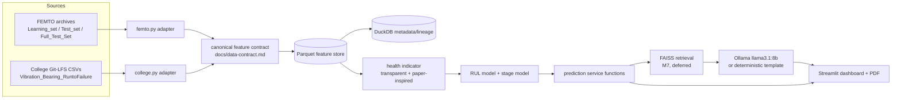

# Architecture

## Data flow (review-track simplified path, section 26.6 of command.md)

## Trust boundaries
- Raw archives (FEMTO zips/7z, college CSVs) are read-only, external, never modified.
- `context/` is local-only input, never a runtime dependency of the shipped app.
- Adapters are the only code that touches raw file formats; everything downstream consumes the canonical feature-row contract.

## Data lineage
Every feature row carries: source dataset, bearing/run id, file id(s), row range, window/acquisition index, code version (git SHA at extraction time), schema version. Stored in DuckDB `feature_batches`, referencing Parquet paths + checksums.

## Training vs. final-evaluation separation
- FEMTO: `Learning_set` (6 bearings) for all fitting (scalers, PCA, HI, model). `Test_set` prefixes may be scored once the pipeline is frozen. `Full_Test_Set` (hidden continuation) used only to compute final RUL error after freeze - never for fitting.
- College: time-ordered expanding-window / rolling-origin backtest on the single trajectory. No cross-bearing generalization claimed.

## Failure behavior
- Missing/optional dependency (Ollama, FAISS) -> deterministic template report, dashboard still renders.
- Missing temperature file -> feature row keeps an explicit `temp_available=false` flag, no fabricated values.
- Malformed CSV chunk -> adapter raises with file id + row range, does not silently coerce.

## Optional components (not on the MVP critical path)
1D CNN over HI (M6), spectral-kurtosis ConvNet (deferred - no fault labels), LSTM monitoring agent (deferred), full RAG pipeline (M7), Ollama benchmarking, PDF report (nice-to-have, priority 3).

## Why raw high-frequency samples stay outside the database
A single college CSV is ~2,000,001 rows x 4 float columns (~64MB in memory as float64); the full 129-file run is ~18GB. FEMTO has tens of thousands of 2560-row acquisitions across 28 bearings. Loading any of this into DuckDB would defeat the "bounded memory" requirement and the lean local-first design. DuckDB stores only metadata/lineage/metrics; Parquet stores the compact engineered feature rows (one row per window/acquisition, not per raw sample).
