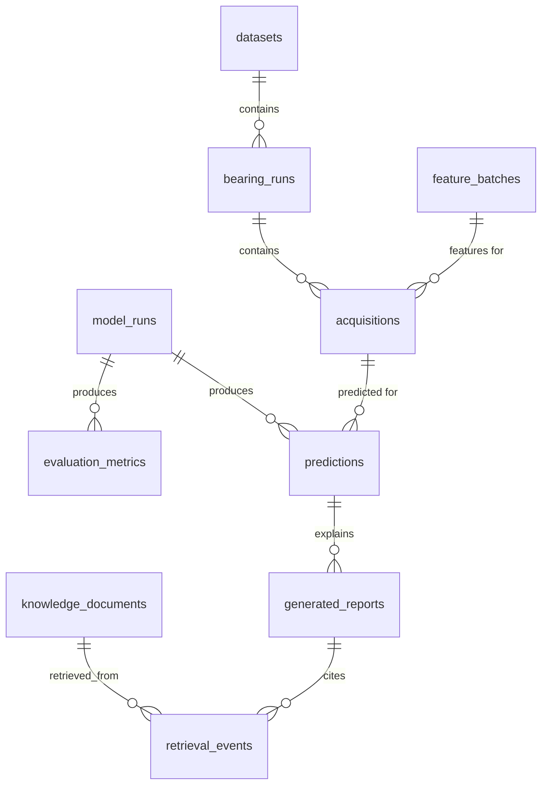

# Database Schema (DuckDB, no ORM)

## Materialization status (as of the review build)

This file defines the **full planned** M0-M9 schema. The current `artifacts/metadata.duckdb` materializes the 5 lineage/metadata tables the review track (M0-M4, M8) actually uses: `schema_version`, `datasets` (2 rows), `bearing_runs` (7 rows: 6 FEMTO learning + 1 college), `acquisitions` (11,564 rows: 7,534 FEMTO + 4,030 college), `feature_batches` (2 rows). The `model_runs`, `evaluation_metrics`, `predictions`, `knowledge_documents`, `retrieval_events`, and `generated_reports` tables belong to the post-review milestones (M5/M7) and are defined here but not yet created - RUL/HI metrics currently live as versioned JSON under `reports/metrics/` (see `docs/database-structure.md`), which the dashboard reads directly.

## ER diagram



## DDL

```sql
CREATE TABLE schema_version (version INTEGER PRIMARY KEY, applied_at TIMESTAMP DEFAULT current_timestamp);
INSERT INTO schema_version VALUES (1, current_timestamp);

CREATE TABLE datasets (
    dataset_id      VARCHAR PRIMARY KEY,      -- 'femto' | 'college'
    display_name    VARCHAR NOT NULL,
    version         VARCHAR NOT NULL,          -- e.g. 'phm2012-ieee-challenge'
    description     VARCHAR
);

CREATE TABLE bearing_runs (
    bearing_run_id   VARCHAR PRIMARY KEY,      -- e.g. 'femto:Bearing1_1', 'college:run1'
    dataset_id       VARCHAR NOT NULL REFERENCES datasets(dataset_id),
    bearing_label    VARCHAR NOT NULL,         -- 'Bearing1_1' or 'college_nsk6205'
    condition_id     INTEGER,                  -- 1/2/3 for FEMTO, NULL for college
    role             VARCHAR NOT NULL,         -- 'learning' | 'test_censored' | 'full_test' | 'college_run'
    operating_speed_rpm_min DOUBLE,
    operating_speed_rpm_max DOUBLE,
    load_description VARCHAR,
    UNIQUE (dataset_id, bearing_label, role)
);

CREATE TABLE feature_batches (
    feature_batch_id VARCHAR PRIMARY KEY,      -- uuid
    dataset_id       VARCHAR NOT NULL REFERENCES datasets(dataset_id),
    schema_version   VARCHAR NOT NULL,         -- feature contract version, docs/data-contract.md
    parquet_path     VARCHAR NOT NULL,
    row_count        INTEGER NOT NULL,
    code_version     VARCHAR NOT NULL,         -- git SHA at extraction
    sha256           VARCHAR NOT NULL,
    created_at       TIMESTAMP DEFAULT current_timestamp
);

CREATE TABLE acquisitions (
    acquisition_id   VARCHAR PRIMARY KEY,      -- uuid
    bearing_run_id   VARCHAR NOT NULL REFERENCES bearing_runs(bearing_run_id),
    kind             VARCHAR NOT NULL,         -- 'femto_acquisition' | 'college_window'
    source_file_path VARCHAR NOT NULL,
    sequence_index   INTEGER NOT NULL,         -- acq index (FEMTO) or window index (college)
    row_start        BIGINT,                   -- college only: source-row range start
    row_end          BIGINT,                   -- college only: source-row range end
    event_timestamp  TIMESTAMP,                -- parsed from filename/header
    sample_rate_hz   DOUBLE NOT NULL,
    n_samples        INTEGER NOT NULL,
    temp_available   BOOLEAN NOT NULL,
    source_sha256     VARCHAR NOT NULL,
    feature_batch_id VARCHAR REFERENCES feature_batches(feature_batch_id),
    feature_row_index INTEGER,                 -- row index within the parquet file
    rul_seconds      DOUBLE,                    -- NULL until label constructed / unknown (hidden)
    stage_label      VARCHAR,
    UNIQUE (bearing_run_id, kind, sequence_index)
);

CREATE TABLE model_runs (
    model_run_id     VARCHAR PRIMARY KEY,      -- uuid
    task             VARCHAR NOT NULL,         -- 'rul_regression' | 'stage_classification'
    model_type       VARCHAR NOT NULL,         -- 'naive_linear' | 'random_forest' | 'extra_trees' | ...
    hyperparams_json VARCHAR NOT NULL,
    seed             INTEGER NOT NULL,
    code_version     VARCHAR NOT NULL,
    train_bearing_run_ids_json VARCHAR NOT NULL,
    artifact_path    VARCHAR,                  -- joblib path
    created_at       TIMESTAMP DEFAULT current_timestamp
);

CREATE TABLE evaluation_metrics (
    metric_id        VARCHAR PRIMARY KEY,      -- uuid
    model_run_id     VARCHAR NOT NULL REFERENCES model_runs(model_run_id),
    split            VARCHAR NOT NULL,         -- 'train' | 'val' | 'test_censored' | 'full_test'
    bearing_run_id   VARCHAR REFERENCES bearing_runs(bearing_run_id), -- NULL = aggregate
    metric_name      VARCHAR NOT NULL,          -- 'mae_seconds' | 'rmse_seconds' | ...
    metric_value     DOUBLE NOT NULL
);

CREATE TABLE predictions (
    prediction_id    VARCHAR PRIMARY KEY,      -- uuid
    model_run_id     VARCHAR NOT NULL REFERENCES model_runs(model_run_id),
    acquisition_id    VARCHAR NOT NULL REFERENCES acquisitions(acquisition_id),
    predicted_rul_seconds DOUBLE,
    predicted_stage   VARCHAR,
    uncertainty_low   DOUBLE,
    uncertainty_high  DOUBLE,
    created_at        TIMESTAMP DEFAULT current_timestamp
);

CREATE TABLE knowledge_documents (
    document_id      VARCHAR PRIMARY KEY,      -- uuid
    title            VARCHAR NOT NULL,
    author           VARCHAR,
    year             INTEGER,
    source_path      VARCHAR NOT NULL,
    license_status   VARCHAR,
    sha256           VARCHAR NOT NULL
);

CREATE TABLE retrieval_events (
    retrieval_id     VARCHAR PRIMARY KEY,      -- uuid
    query_text       VARCHAR NOT NULL,
    document_id      VARCHAR NOT NULL REFERENCES knowledge_documents(document_id),
    chunk_id         VARCHAR NOT NULL,
    relevance_score  DOUBLE NOT NULL,
    created_at       TIMESTAMP DEFAULT current_timestamp
);

CREATE TABLE generated_reports (
    report_id        VARCHAR PRIMARY KEY,      -- uuid
    prediction_id    VARCHAR NOT NULL REFERENCES predictions(prediction_id),
    llm_model        VARCHAR,                   -- e.g. 'llama3.1:8b' or 'deterministic_template'
    template_used    BOOLEAN NOT NULL,
    report_path      VARCHAR NOT NULL,
    created_at       TIMESTAMP DEFAULT current_timestamp
);
```

## Example queries

```sql
-- per-bearing MAE for the latest RUL model run
SELECT br.bearing_label, em.metric_value
FROM evaluation_metrics em
JOIN model_runs mr ON mr.model_run_id = em.model_run_id
JOIN bearing_runs br ON br.bearing_run_id = em.bearing_run_id
WHERE mr.task = 'rul_regression' AND em.metric_name = 'mae_seconds'
ORDER BY mr.created_at DESC;

-- acquisitions still missing engineered features
SELECT acquisition_id, source_file_path FROM acquisitions WHERE feature_batch_id IS NULL;
```

## Migration strategy
Single `schema_version` table, integer version, additive-only migrations (`ALTER TABLE ... ADD COLUMN`) applied by a small `scripts/migrate_db.py` (M2). No destructive migrations without a new `docs/decisions.md` entry.
